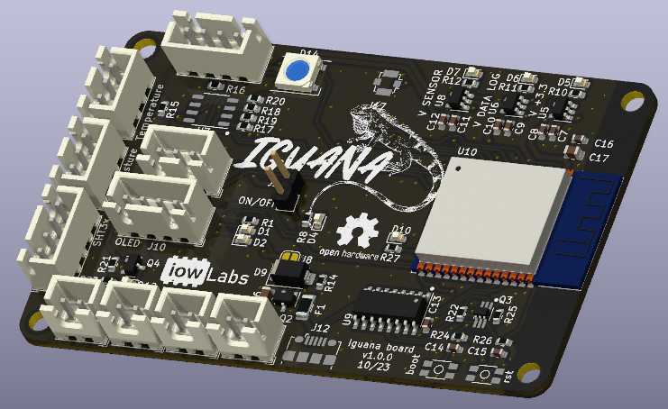
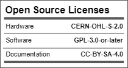
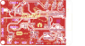
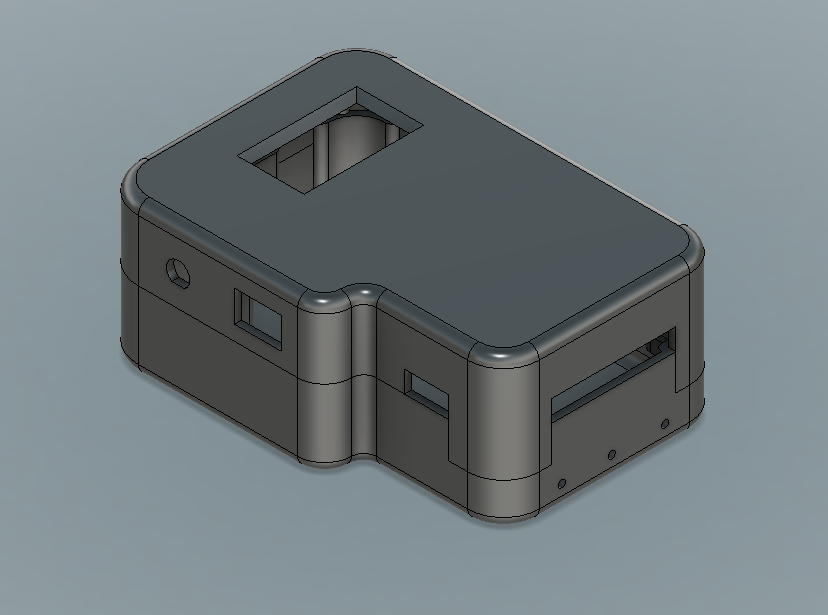
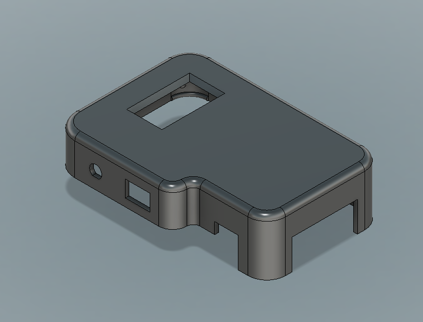
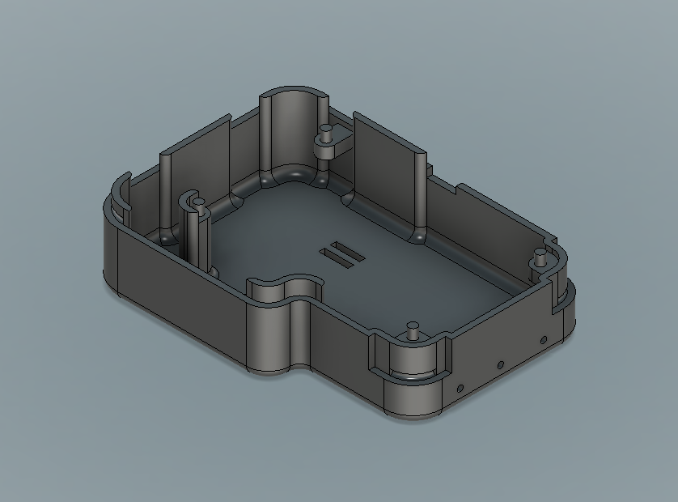

# iowLabs Iguana

Iguana is a LoRa sensor for smartCitys. It is an instrument designed to monitor soil temperature and humidity in real time. It is a low-cost device designed to address a wide range of scenarios. It has connectivity to different types of wireless networks (LoRa, Bt, BLE, Wifi, RF), adapting to a large number of IoT applications.

The PCB was designed with various scenarios in mind that contemplate the common needs associated with automatic irrigation, smart agriculture and soil quality monitoring. Both at the level of domestic applications and at the level of industrial applications.

The sensor considers compatibility with the following sensors:

- Soil moisture sensor ds18b20
- soil temperature sensor.
- Humidity and ambient temperature sensor.

It also has a  on board driver for a little water pump, a LoRa module, an RTC module and an SD socket for datalogger functions and an OLED screen to display instant information. Another interesting attribute is that it has an RS485 converter, which allows the iguana device to be integrated with industrial sensors for monitoring soil humidity and quality that are usually compatible with ModBus RS485 protocols.

**IoT**,**LoRa**, **Environmental measurement**, **Soil mositure**, **datalogger**, **MODBUS RS485**.

### OSHW LICENSES

   

## Hardware description

The PCB was designed in KiCad7 stable realease and additional components used can be found in the official [iowLabs](https://github.com/iowlabs/KiCad_Lib) library.

It has an ESP32 microcontroller, an RF95 module to integrate into LoRa and LoRaWAN network solutions. It has an RTC RV8803 and a micro SD card connector necessary to implement data logger functions.
It additionally has a "max485" module to integrate probes for quality monitoring of industrial soils based on MODBUS RS485 communication protocol.

A simple NPN-based controller allows you to integrate small water pumps to implement automatic and remote irrigation control functionalities.

An OLED display and RGB LED let you see real-time information from the sensors.

It also has a charging module for lipo batteries based on the integrated TP4056 and a charging protection circuit. Integration with solar panel based applications can be easily achieved.

To manage the power of the circuit, an MT3608 DC DC converter and a set of LDO regulators are used that power the digital electronics, the sensors and the data logger independently. The regulators that power the units can be disabled via firmware to implement low-power features.

### Dependencies
The board is based on an ESP32 microcontroller.

- USB communication through IC CH340
- Lora rfm95 module.
- microSD socket.
- RV8803 RTC module.
- max485 for RS485 communication.
- On board pump driver with a NPN 2N3904.
- On board battery charger compatible with 3.7V lipo bateries, based on TP4056.
- ws2812 RGB LED
- OLED display

### Schematic

### Layout
The layout is a 2 layers 8x5cm pcb.

| Top view | Bottom view |
| -------- | ----------- |
| ||

### BOM

The bill of materials with respective references to the LCSC part numbers of the iguana PCB components can be found in the following [link](hardware/output_files/Iguana_V1_BOM.csv).

Below is a list of the components for the probes and sensors that complement the iguana device to implement all its functionalities. The prices provided and the links are for reference only.

|  component 	| ref price 	| description 	| Link 		|
| ----------- 	| ----------- 	| ------------- | ---------	|
| Soil mositure sensor| | 	Low cost, soil moisture capacitive sensor	|			|
| Soil temperature sensor | | Sensor ds18b20 | |
| Sensor de humedad y temperatura ambiente | | SHT31 - case outdoor IP68 | |
| Sensor de Temperatura y humedad de suelo industrial | | Sensor MODBUS 485 capacitivo, de humedad y temperatura de suelo. | |
| Pantalla OLED |  | 128x64 1.3'' | |
| Batería LiPo  |  | Batería lipo 3.7V 2500mAh.Tamaño menor a 65x55cm.  | |
| Tarjeta microSD | | 16GB | |
| Batería 2012 	| | Batería 3.3V CR2012 | |

## 3D Model

The design allows the integration of the OLED and RGB LED display to monitor the status of the device and read the latest value from the sensors. it leaves exposed the connectors for the probes, the SMA connector for the LoRa antenna, and a switch to turn the device on and off.

| Cover | Base |
| -------- | ----------- |
| ||

Design view files:

- [plans](Iguna_case_V2.pdf)

The device considers a 65x54 cm 3.7V lipo battery for power. This battery can be charged externally through the USB connector or through the charging input connector.

Editable files and display plans can be found in [directorio](3Dmodel/Source_files).

The PCB design allows it to fit commercial project enclosures with IP65 standards or higher for outdoor or harsh weather applications.

## Firmware

The developed firmware represents a collection of libraries and drivers for the board's dependencies.

This collection of useful functions is implemented in the iowIguana library. However, due to the flexibility of the design, it is possible to load a wide variety of code based on other supported libraries.

The firmware was developed using PlatformIO; however, usage examples were generated for [Arduino IDE] (https://www.arduino.cc/en/software).

|  Folder  | Description |
| -----------| ----------- |
| [firmware/iguana_project](firmware/iguana_project) | The complete project compiled in its last version.|
| [firmware/examples](firmware/examples) | Arduino compatible example codes .|
| [firmware/src](firmware/src) | The source files of the library made for iguana.|

### Used libraries
Except for the uSD_iow library which is available in the official iowlabs repository, all other libraries used are available from the official Arduino and PlatformIO library manager.

- RTC 			: sparkfun/SparkFun Qwiic RTC RV8803 Arduino Library @ ^1.2.8
- Temperature sensor	: paulstoffregen/OneWire@^2.3.7
- Temperature sensor 	: milesburton/DallasTemperature@^3.11.0
- Temperature and humidity sensor : adafruit/Adafruit SHT31 Library@^2.2.2
- Temperature and humidity sensor : adafruit/Adafruit BusIO@^1.14.3
- Temperature and humidity sensor : adafruit/Adafruit Unified Sensor@^1.1.13
- ArduinoJson	:	bblanchon/ArduinoJson@^6.21.3
- OLED			: adafruit/Adafruit SH110X @ ^2.1.8
- OLED 			: adafruit/Adafruit GFX Library @ ^1.11.5
- fastLED		: fastled/FastLED@^3.6.0
- LoRa 			: sandeepmistry/LoRa @ ^0.8.0
- MQTT               : knolleary/PubSubClient@^2.8

### Available examples

| File | Description |
|---------|-------------|
| simple_version.ino  | Collect the data from the soil moisture and the soil temperature sensors, and displays it on the screen. Print the collected data in json format through the serial monitor. |
| low_energy_version.ino |  Adds a low-power mode to the simple_version code |
| lora_version.ino | Activate the LoRa module and send a message in json format. |
| mqtt_version.ino | This is an example of reading the data and sending it via MQTT to a pre-established broker.|

### Available functions

- uint8_t begin(void);
- void readSoilTemperature(void);
- void readSoilMoisture(void);
- void readSTH(void);
- void readRS485(void);
- void readSensors(void);
- String pubData(void);
- void activateSensors(uint8_t sens);
- void activateLoRa(void);
- void activateAll(void);
- void iowLogo(void);
- void showLogo(void);
- void showStatus(void);
- void showData(long time_interval);
- void saveData(void);
- void moistureCal(uint8_t val);
- void temperatureCal(uint8_t val);

## Instruction and usage
